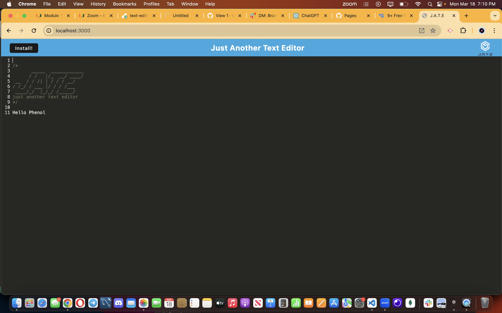

# 19 Progressive Web Applications (PWA): Text Editor

## Description

Provide a short description explaining the what, why, and how of your project. Use the following questions as a guide:

- What was your motivation?
 My motivation was to complete and fix creating a text editor that runs in the browser.
- Why did you build this project? (Note: the answer is not "Because it was a homework assignment.")
 I built this project in order to implement my understanding of how PWA's work and the process of it.
- What problem does it solve?
The problem it solves is building a text editor that runs on a browser and and can be functional offline.
- What did you learn?

## Installation

What are the steps required to install your project? Provide a step-by-step description of how to get the development environment running.

First a github repository needs to be created make sure it has a README.md file, then clone the repository and paste it in your Week 4 folder. Then open the developer folder in the class repository and copy the material inside the folder into the repository folder. Then you can continue work on the assignment.

## Usage

Provide instructions and examples for use. Include screenshots as needed.

To add a screenshot, create an `assets/images` folder in your repository and upload your screenshot to it. Then, using the relative filepath, add it to your README using the following syntax:

  
    
## Credits
CHARLES PUENTE-MATOS ONE OF THE TUTORING TEACHERS ASSISTED ME ON PART OF THIS ASSIGNMENT!
I DID USE YOUTUBE AND OTHER SITES TO HELP ME IMPLEMENT AND COME TO AN UNDERSTANDING OF CODE THAT I AM USING!!!

## User Story

```
AS A developer
I WANT to create notes or code snippets with or without an internet connection
SO THAT I can reliably retrieve them for later use
md

```

## Acceptance Criteria

```
GIVEN a text editor web application
WHEN I open my application in my editor
THEN I should see a client server folder structure
WHEN I run `npm run start` from the root directory
THEN I find that my application should start up the backend and serve the client
WHEN I run the text editor application from my terminal
THEN I find that my JavaScript files have been bundled using webpack
WHEN I run my webpack plugins
THEN I find that I have a generated HTML file, service worker, and a manifest file
WHEN I use next-gen JavaScript in my application
THEN I find that the text editor still functions in the browser without errors
WHEN I open the text editor
THEN I find that IndexedDB has immediately created a database storage
WHEN I enter content and subsequently click off of the DOM window
THEN I find that the content in the text editor has been saved with IndexedDB
WHEN I reopen the text editor after closing it
THEN I find that the content in the text editor has been retrieved from our IndexedDB
WHEN I click on the Install button
THEN I download my web application as an icon on my desktop
WHEN I load my web application
THEN I should have a registered service worker using workbox
WHEN I register a service worker
THEN I should have my static assets pre cached upon loading along with subsequent pages and static assets
WHEN I deploy to Render
THEN I should have proper build scripts for a webpack application
md
```
---
© 2023 edX Boot Camps LLC. Confidential and Proprietary. All Rights Reserved.
